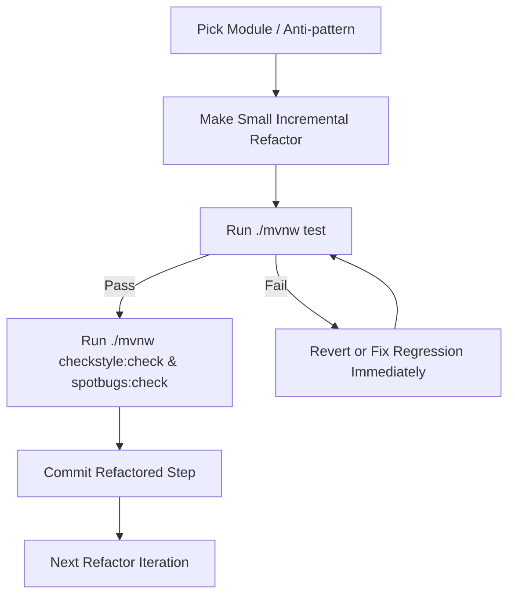

# Continuous Integration (CI) & Quality Safety Net

This document outlines the automated testing, linting, and Continuous Integration pipeline configured for this Java Spring Boot project.

---

## 1. Pipeline Overview

The CI pipeline runs automatically via **GitHub Actions** (`.github/workflows/ci.yml`) on every `push` and `pull_request` to any branch.

It ensures that:
1. **Source Code Compiles**: The Java 21 codebase builds cleanly with Maven.
2. **Code Style & Standards (Checkstyle)**: Checks for formatting rules, unused imports, missing braces, naming conventions, and modifier order.
3. **Static Analysis & Bug Detection (SpotBugs)**: Detects code smells, potential bugs, resource leaks, mutability exposure, and anti-patterns.
4. **Automated Regression Test Suite**: Executes all 548 unit, service, and controller regression tests to ensure no existing functionality is broken.
5. **Code Coverage (JaCoCo)**: Generates execution coverage metrics for refactoring validation.

---

## 2. Local Commands (CLI)

Run these commands from the `Back-end` directory:

| Command | Purpose | When to Run |
|---|---|---|
| `./mvnw test` | Runs the full regression test suite (548 tests). | After every refactoring change. |
| `./mvnw checkstyle:check` | Analyzes code style, imports, and formatting rules. | Before committing code. |
| `./mvnw spotbugs:check` | Detects potential bug patterns and code smells. | To inspect code quality improvements. |
| `./mvnw jacoco:report` | Generates code coverage report in `target/site/jacoco/`. | To evaluate test coverage after refactors. |
| `./mvnw clean verify` | Runs the complete CI pipeline locally in one command. | Before pushing changes. |

*(On Windows PowerShell / CMD, use `.\mvnw.cmd <command>` instead of `./mvnw`)*

---

## 3. Test Setup & Isolation

- **In-Memory Test Database**: Tests use an isolated in-memory **H2** database configured in `src/test/resources/application.properties` (with `MODE=MySQL`). No external MySQL server or internet connection is required to run the test suite.
- **External Integration Mocks**: Cloudinary, JavaMailSender, and Google OAuth services are isolated in tests to allow fast, deterministic, non-blocking execution.

---

## 4. Interpreting CI & Quality Results

### 🧪 Test Failures (`./mvnw test`)
- If a test fails, Maven will output the test class name and failure stack trace.
- Detailed Surefire reports are saved to: `Back-end/target/surefire-reports/`.
- **Action**: Fix any unintended behavioral regression before moving to the next refactoring step.

### 🔍 Checkstyle Violations (`./mvnw checkstyle:check`)
- Checkstyle configuration is located in [`Back-end/checkstyle.xml`](file:///d:/FPTU/9.Gap/Interviews/Day1/practical/Back-end/checkstyle.xml).
- Warnings highlight unused imports (`UnusedImports`), star imports (`AvoidStarImport`), missing block braces (`NeedBraces`), or missing default clauses (`MissingSwitchDefault`).

### 🐛 SpotBugs Code Smells (`./mvnw spotbugs:check`)
- SpotBugs flags issues such as:
  - `EI_EXPOSE_REP2`: Exposing internal representation via mutable objects.
  - `DMI_RANDOM_USED_ONLY_ONCE`: Inefficient/insecure random object instantiation.
  - `UC_USELESS_CONDITION`: Redundant conditional checks.
  - `URF_UNREAD_FIELD`: Dead or unread fields.
- Detailed HTML reports can be inspected under `Back-end/target/spotbugs/`.

---

## 5. Refactoring Protocol

When refactoring toward OOP principles, SOLID guidelines, and Design Patterns:

